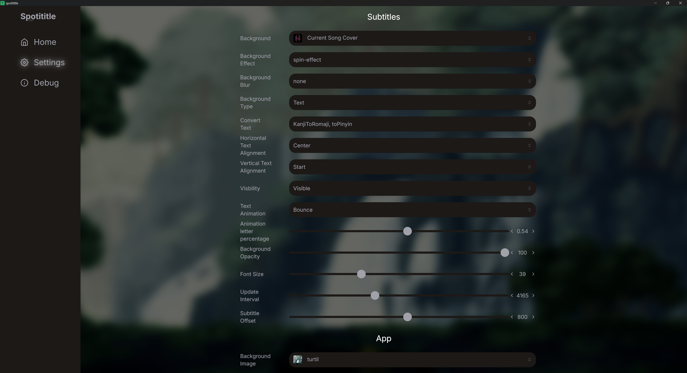

# Spotititle 2.0

Spotititle is a Tauri-based application designed to display real-time song titles and lyrics as subtitles. It uses a token (SP DC) that allows the backend to fetch the current song playing and its corresponding lyrics. The app consists of two windows: one for configuring settings, debugging, and inputting the SP DC token, and another to display the subtitles. (Spotititle 2.0 is an upgrade from a rudamentary c++ concept called [Spotititle](https://github.com/oudend/spotititle))

- Home & Settings Window:  
  
  

- Subtitles Window:  
  

## Table of Contents

- [Features](#features)
- [Prerequisites](#prerequisites)
- [Installation](#installation)
- [Development](#development)
- [Build](#build)
- [Usage](#usage)
- [Directory Structure](#directory-structure)
- [Contributing](#contributing)
- [License](#license)
- [Contact](#contact)

## Features

- **Real-time Lyrics Display**: Displays the lyrics of the currently playing song in a dedicated subtitle window.
- **SP DC Authentication**: Input the SP DC token to authenticate and fetch song details.
- **Settings & Debugging**: Provides a secondary window for configuration, debugging, and input management.

## Prerequisites

Ensure that you have the following installed:

- [Node.js](https://nodejs.org/) (version 16 or later)
- [npm](https://www.npmjs.com/) or [yarn](https://yarnpkg.com/)
- [Rust](https://www.rust-lang.org/) (required for Tauri)
- [Tauri CLI](https://tauri.app/)

You can install Tauri CLI by running:

```bash
cargo install tauri-cli
```

## Installation

1. Clone the repository:

   ```bash
   git clone https://github.com/your-username/spotititle.git
   ```

2. Navigate to the project directory:

   ```bash
   cd spotititle
   ```

3. Install the dependencies:

   Using npm:

   ```bash
   npm install
   ```

   Using yarn:

   ```bash
   yarn install
   ```

## Development

To run the app in development mode:

```bash
npx tauri dev
```

This will start the development server with hot reloading for the React components and the Tauri app.

## Build

To build the app for production:

```bash
npx tauri build
```

The build artifacts will be generated in the `src-tauri/target/release/` directory.

## Usage

You can download the latest version of Spotititle from the [Releases](https://github.com/oudend/Spotititle2/releases) page.

1. Launch the app.
2. In the **Settings & Debugging Window**, input your SP DC token.
3. Once authenticated, the app will start displaying the current song and lyrics in the **Subtitles Window**.

## Directory Structure

```bash
.
├── src/                   # React app source code
├── src-tauri/             # Tauri-related files
│   ├── src/               # Rust source code for Tauri app
│   ├── tauri.conf.json    # Tauri configuration
├── public/                # Static assets for the React app
└── README.md              # Project documentation
```

## Contributing

Contributions are welcome! To contribute:

1. Fork the repository.
2. Create a new branch for your feature/bugfix.
3. Commit your changes and push the branch to your fork.
4. Open a pull request.

### Before Submitting a Pull Request:

- Run the project locally to test your changes.

## License

This project is licensed under the Mozilla Public License Version 2.0 License. See the [LICENSE](LICENSE) file for more details.

## Contact

If you have any questions, feel free to open an issue or contact me at ternermartin@gmail.com.
